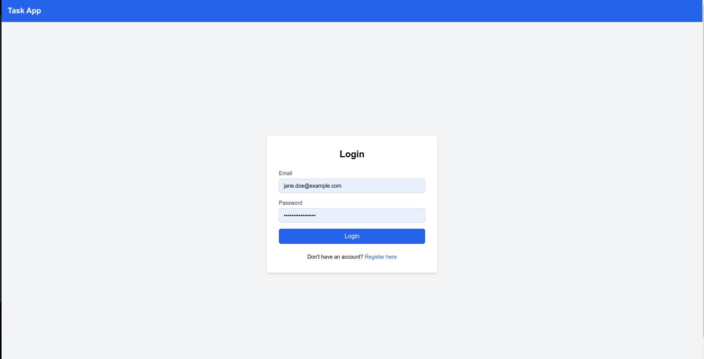
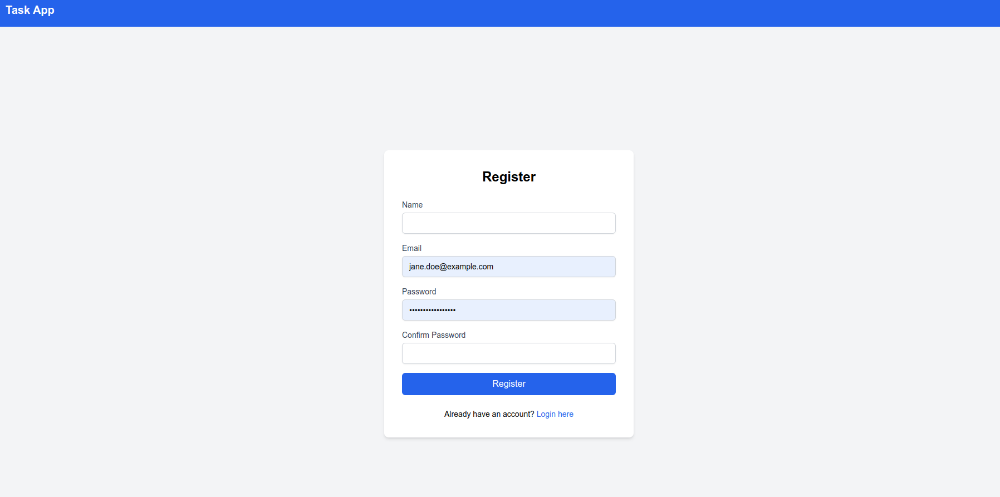
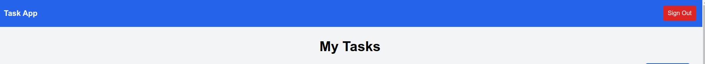
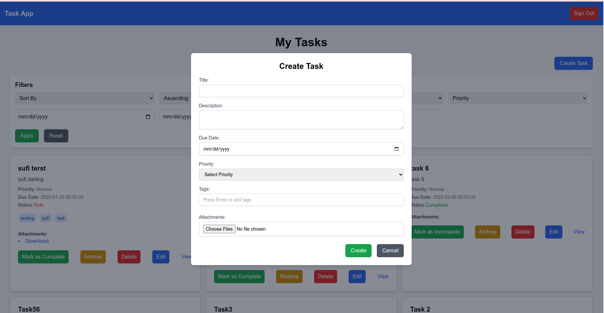
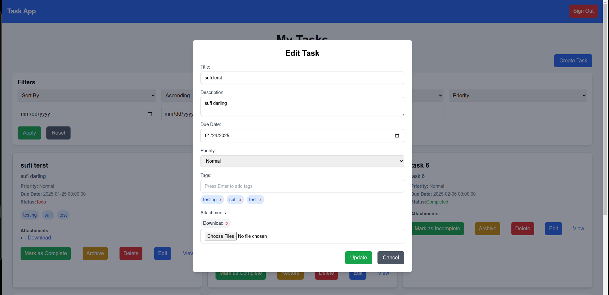
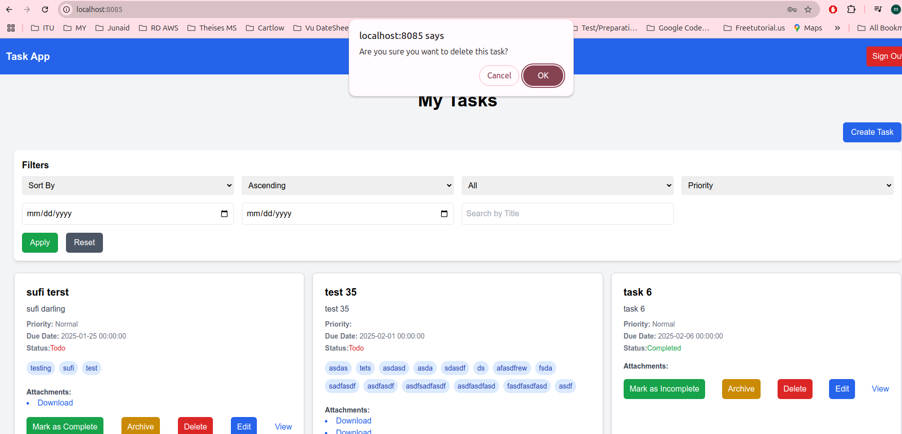
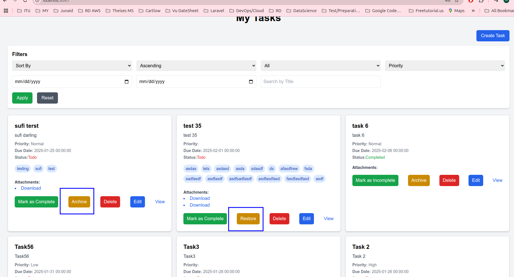

# Task Management Application

## Table of Contents

* [Overview](https://chatgpt.com/g/g-p-678f68d0097c8191996e77c5294b8a08-setup-laravel-with-vue-js/c/678fa244-0c20-8003-9eb1-a29e690b5a22#overview)
* [Setup](https://chatgpt.com/g/g-p-678f68d0097c8191996e77c5294b8a08-setup-laravel-with-vue-js/c/678fa244-0c20-8003-9eb1-a29e690b5a22#setup)
  * [Prerequisites](https://chatgpt.com/g/g-p-678f68d0097c8191996e77c5294b8a08-setup-laravel-with-vue-js/c/678fa244-0c20-8003-9eb1-a29e690b5a22#prerequisites)
  * [Docker Setup](https://chatgpt.com/g/g-p-678f68d0097c8191996e77c5294b8a08-setup-laravel-with-vue-js/c/678fa244-0c20-8003-9eb1-a29e690b5a22#docker-setup)
* [Backend (Laravel)](https://chatgpt.com/g/g-p-678f68d0097c8191996e77c5294b8a08-setup-laravel-with-vue-js/c/678fa244-0c20-8003-9eb1-a29e690b5a22#backend-laravel)
* [Frontend (Vue)](https://chatgpt.com/g/g-p-678f68d0097c8191996e77c5294b8a08-setup-laravel-with-vue-js/c/678fa244-0c20-8003-9eb1-a29e690b5a22#frontend-vue)
* [Features](https://chatgpt.com/g/g-p-678f68d0097c8191996e77c5294b8a08-setup-laravel-with-vue-js/c/678fa244-0c20-8003-9eb1-a29e690b5a22#features)
  * [Authentication](https://chatgpt.com/g/g-p-678f68d0097c8191996e77c5294b8a08-setup-laravel-with-vue-js/c/678fa244-0c20-8003-9eb1-a29e690b5a22#authentication)
    * [Login](https://chatgpt.com/g/g-p-678f68d0097c8191996e77c5294b8a08-setup-laravel-with-vue-js/c/678fa244-0c20-8003-9eb1-a29e690b5a22#login)
    * [Register](https://chatgpt.com/g/g-p-678f68d0097c8191996e77c5294b8a08-setup-laravel-with-vue-js/c/678fa244-0c20-8003-9eb1-a29e690b5a22#register)
    * [Sign Out](https://chatgpt.com/g/g-p-678f68d0097c8191996e77c5294b8a08-setup-laravel-with-vue-js/c/678fa244-0c20-8003-9eb1-a29e690b5a22#sign-out)
  * [Task Management](https://chatgpt.com/g/g-p-678f68d0097c8191996e77c5294b8a08-setup-laravel-with-vue-js/c/678fa244-0c20-8003-9eb1-a29e690b5a22#task-management)
    * [Create Task](https://chatgpt.com/g/g-p-678f68d0097c8191996e77c5294b8a08-setup-laravel-with-vue-js/c/678fa244-0c20-8003-9eb1-a29e690b5a22#create-task)
    * [Update Task](https://chatgpt.com/g/g-p-678f68d0097c8191996e77c5294b8a08-setup-laravel-with-vue-js/c/678fa244-0c20-8003-9eb1-a29e690b5a22#update-task)
    * [Delete Task](https://chatgpt.com/g/g-p-678f68d0097c8191996e77c5294b8a08-setup-laravel-with-vue-js/c/678fa244-0c20-8003-9eb1-a29e690b5a22#delete-task)
    * [Archive Task](https://chatgpt.com/g/g-p-678f68d0097c8191996e77c5294b8a08-setup-laravel-with-vue-js/c/678fa244-0c20-8003-9eb1-a29e690b5a22#archive-task)
    * [Pagination](https://chatgpt.com/g/g-p-678f68d0097c8191996e77c5294b8a08-setup-laravel-with-vue-js/c/678fa244-0c20-8003-9eb1-a29e690b5a22#pagination)
* [Console Commands](https://chatgpt.com/g/g-p-678f68d0097c8191996e77c5294b8a08-setup-laravel-with-vue-js/c/678fa244-0c20-8003-9eb1-a29e690b5a22#console-commands)

---

## Overview

This is a Task Management application built with:

* **Backend** : Laravel (PHP)
* **Frontend** : Vue 3 (with Vite, Pinia, Vue Router, and Axios)
* **Containerization** : Docker

---

## Setup

### Prerequisites

* **Docker & Docker Compose** : Make sure Docker is installed on your system.
* **Node.js & npm** : Ensure you have Node.js installed for local frontend development (optional).

---

### Docker Setup

1. Clone the repository:
   ```bash
   git clone <repository_url>
   cd <repository_directory>
   ```
2. Start the application using Docker Compose:
   ```bash
   docker-compose up --build
   ```
3. Access the application:
   * **Backend** : `http://localhost:80`
   * **Frontend** : `http://localhost:8085`
4. Run Laravel migrations and seed the database:
   ```bash
   docker exec -it <backend_container_name> php artisan migrate --seed
   ```
5. Generate Laravel API documentation (if needed):
   ```bash
   docker exec -it <backend_container_name> php artisan scribe:generate
   ```

---

## Backend (Laravel)

The backend is built using Laravel, providing a RESTful API for task management and user authentication.

### Key Commands

* **Migrate Database** :

```bash
  docker exec -it <backend_container_name> php artisan migrate
```

* **Seed Database** :

```bash
  docker exec -it <backend_container_name> php artisan db:seed
```

* **Run Tests** :

```bash
  docker exec -it <backend_container_name> php artisan test
```

---


## Frontend (Vue)

The frontend is built using Vue 3, with a responsive design and integration with the Laravel API.

### Key Commands

* **Install Dependencies** :

```bash
  docker exec -it <frontend_container_name> npm install
```

* **Run Development Server** :

```bash
  docker exec -it <frontend_container_name> npm run dev
```

* **Build for Production** :

```bash
  docker exec -it <frontend_container_name> npm run build
```

---

## Features

### Authentication

#### Login

*Login functionality allows users to securely access the application.*



---

#### Register

*Users can create a new account.*



---

#### Sign Out

*Securely log out of the application.*



---

### Task Management

#### Create Task

*Users can add tasks with priorities, due dates, and tags.*



---

#### Update Task

*Editing an existing task's details.*



---

#### Delete Task

*Remove tasks from the list.*

---



#### Archive Task

*Move tasks to the archive.*



---

#### Pagination

*View tasks with pagination controls.*

**[Insert Pagination Screenshot]**

---

## Console Commands

Here’s a summary of commonly used commands for backend and frontend:

### Backend (Laravel)

* **Run Migrations** :

```bash
  docker exec -it <backend_container_name> php artisan migrate
```

* **Seed Database** :

```bash
  docker exec -it <backend_container_name> php artisan db:seed
```

* **Generate API Documentation** :

```bash
  docker exec -it <backend_container_name> php artisan scribe:generate
```

    

**Delete Archived Tasks**:

```
docker exec -it <backend_container_name> php artisan tasks:delete-archived
```

*This command deletes tasks that have been archived for more than one week.*

---


### Frontend (Vue)

* **Install Dependencies** :

```bash
  docker exec -it <frontend_container_name> npm install
```

* **Run Development Server** :

```bash
  docker exec -it <frontend_container_name> npm run dev
```
